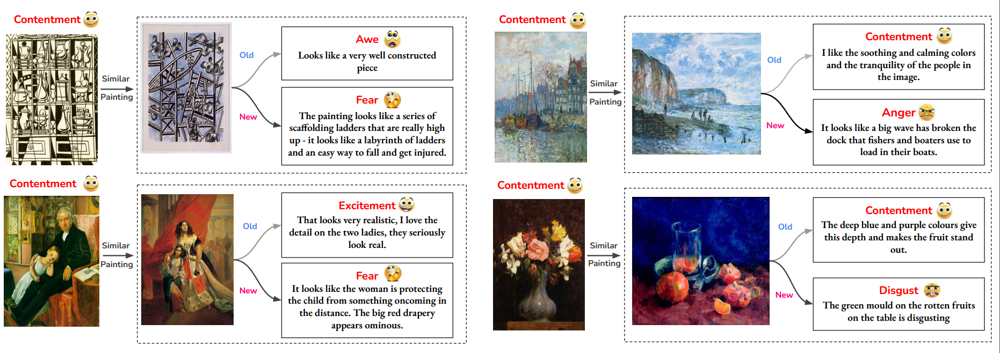

# It is Okay to Not Be Okay: Overcoming Emotional Bias in Affective Image Captioning by Contrastive Data Collection

This repo host the codebase used in this paper which was accepted at CVPR 2022. It contains the following:

* [How to download/preprocess the dataset?](#dataset-download)
* How to train and test Neural Speakers?
  * [Show, Attend, and Tell](#show-attend-and-tell)
  * [Meshed Memory Transformer](#meshed-memory-transformer)
* [Semantic Space Theory analysis](#semantic-space-theory-analysis)

The following figure shows a sample of contrasting emotions for visually similar paintings.


## Dataset Download

Our contrastive dataset complements ArtEmis, thus to compile the full version, you should download:

* [ArtEmis](https://www.artemisdataset.org/#dataset)
* [Contrastive data](https://www.artemisdataset-v2.org/)

Next, unzip ArtEmis into `dataset/official_data/` and place the `Contrastive.csv` file under the same directory.

To merge them and create the train test splits. Please follow the preprocessing steps in the SAT [section](#dataset-preprocessing).

## Show Attend and Tell

Our implementation is heavily based on the SAT model in the original ArtEmis dataset<sup>[1]</sup>. We made this repo self-contained by including the instructions and files to reproduce the results of our paper. But, for more detailed instructions and analysis notebooks, please refer to the original [repo](https://github.com/optas/artemis).

### Environment setup (SAT)

Please install [conda](https://docs.conda.io/projects/conda/en/latest/user-guide/install/) if you have not already. Then,

```bash
cd neural_speaker/sat/
conda create -n artemis-sat python=3.6.9 cudatoolkit=10.0
conda activate artemis-sat
pip install -e .
```

### Dataset Preprocessing

Now, you can resume combining and preprocessing the dataset.

```bash
conda activate artemis-sat
python dataset/combine.py --root dataset/official_data/
python neural_speaker/sat/artemis/scripts/preprocess_artemis_data.py -save-out-dir dataset/full_combined/train/ -raw-artemis-data-csv  dataset/official_data/combined_artemis.csv --preprocess-for-deep-nets True 
python dataset/create_parts.py
```

Congratulations, you now have the preprocessed data ready!

The naming of each directory reflects the type of instances in each dataset:

Train sets:

* `combined` is basically ArtEmis 2.0, it contains all the contrastive data and a sample of similar size from ArtEmis 1.0
* `full_combined` contains all contrastive data and all of ArtEmis 1.0
* `new` contains all the contrastive data only
* `old_full` is ArtEmis 1.0
* `old_large` a sample of same size as `combined` but all samples come from ArtEmis 1.0
* `old_small` a sample of same size as `new` but comes only from ArtEmis 1.0

Test sets:

* `test_40` is the subset from ArtEmis 1.0 with paintings having 40+ annotations, it contains ~700 paintings
* `test_all` is a test set from the ArtEmis 2.0 with samples from both ArtEmis 1.0 and the contrastive data
* `test_new` contains samples only from the contrastive data
* `test_old` contains samples only from ArtEmis 1.0
* `test_ref` is the same test set used in the original ArtEmis paper

Except for `test_40` all test sets have paintings with 5 captions. We made sure that these paintings are not included in any training set.
We created all of these test sets to guarantee a fair comparison and ensure no data leak.

Now, let's train some Neural Speakers next. We will start first with Show, Attend, and Tell since we have already setup its environment, then we will train [Meshed Memory Transformer](#meshed-memory-transformer).

### SAT Neural Speaker

The pipeline for the SAT neural speaker is as follows (each phase has it's scripts):

* [Train](neural_speaker/sat/artemis/scripts/train_speaker.py) a SAT model on a preprocessed dataset, and save the trained model
* [Caption](neural_speaker/sat/artemis/scripts/sample_speaker.py) a test set using the trained SAT model, and save the generated captions to a file
* [Evaluate](neural_speaker/sat/get_scores.py) the generated captions via a master script and [notebooks](neural_speaker/sat/artemis/notebooks) for in depth analysis

#### Training SAT model

To train a SAT model,

```bash
conda activate artemis-sat
mkdir -p <LOGS PATH>
python neural_speaker/sat/artemis/scripts/train_speaker.py \
 -log-dir <LOGS PATH> \
 -data-dir <TRAIN DATASET PATH>  \
 -img-dir <PATH TO WIKIART IMAGES>  \
 [--use-emo-grounding True]
```

For example to train on the Combined dataset with emotional grounding (if you followed the exact setup)

```bash
conda activate artemis-sat
mkdir -p sat_logs/sat_combined
python neural_speaker/sat/artemis/scripts/train_speaker.py \
 -log-dir sat_logs/sat_combined \
 -data-dir dataset/combined/train/  \
 -img-dir <PATH TO WIKIART IMAGES>  \
 --use-emo-grounding True
```

The trained SAT model will be saved under the `log-dir`

NOTE: you can try different training sets found at `datasets/`

#### Generating Captions

Now, let's use our trained model to generate captions. For example let's use the model trained above and generate captions for the $ArtEmis_{C40}$ test set.

```bash
conda activate artemis-sat
mkdir -p sat_sampled
python neural_speaker/sat/artemis/scripts/sample_speaker.py \
-speaker-saved-args sat_logs/sat_combined/config.json.txt \
-speaker-checkpoint sat_logs/sat_combined/checkpoints/best_model.pt \
-img-dir <PATH TO WIKIART IMAGES> \
-out-file  sat_sampled/sat_combined.pkl \
--custom-data-csv  dataset/test_40/test_40.csv 
```

The generated captions will be saved at `sampled/sat_combined.pkl`. Next, we will evaluate them against the ground truth captions.

#### Generated Captions Evaluation

To produce the metrics reported in the paper for the generated captions,

```bash
conda activate artemis-sat
python neural_speaker/sat/get_scores.py \
-captions_file sat_sampled/sat_combined.pkl \
-vocab_path dataset/combined/train/vocabulary.pkl \
-test_set dataset/test_40/test_40.csv \
[--filter (fine | coarse)]
```

`--filter` argument is used to break down the scores per emotions as reported in the paper. You can select one of the 3 available options [fine, coarse]; fine break the score per 9 emotions while coarse break the scores per 3 classes (positive, negative, and something-else)

NOTE: `get_scores.py` has more metrics, have fun trying them out.

Finally, you can use `neural_speaker/sat/visualizations.ipynb` to get the plots used in the paper. You can also use it to visualize the captions and some attention maps over the input images. We also decided to leave the original analysis notebooks from ArtEmis 1.0 under `neural_speaker/sat/artemis/notebooks/` because they are very rich and can help gain useful insights.

## Meshed Memory Transformer

Again, our implementation is heavily based on the M2 model in the original ArtEmis dataset found [here](https://github.com/Kilichbek/artemis-speaker-tools-b). For more details, please visit their repo. We included mostly relevant instructions and files to reproduce the results in our paper.

### Environment setup (M2)

To reproduce our results, unfortunately, you have to install a conda env for each neural speaker. We faced lots of comptability issues when we tried to merge the two envs into one, so we kept them separate.

```bash
cd neural_speaker/m2/
conda env create -f environment.yml
conda activate artemis-m2
```

You also have to download spacy data for calculating the metrics,

```bash
python -m spacy download en
```

### Data preparation

DISCLAIMER: THIS PART IS COPIED FROM THE ORIGINAL [REPO](https://github.com/Kilichbek/artemis-speaker-tools-b)

Please, prepare annotations and detection features files for the ArtEmis dataset to run the code:

1. Download [Detection-Features](https://drive.google.com/file/d/1PJyaiuPgPAH8uwkAUzezvli89E4EJFSZ/view?usp=sharing) and unzip it to some folder.
2. Download [pickle file](https://drive.google.com/file/d/1gjzGK-D9bqxPjjvYdM51sJSm3Vzvh59G/view?usp=sharing) which contains [<image_name>, <image_id>], and put it in the same folder where you have extracted detection features.

We suggest placing the above files under `neural_speaker/m2/extracted_features/`

#### Training M2 model

To train a M2 model,

```bash
conda activate artemis-m2
python neural_speaker/m2/train.py \
  --exp_name combined \
  --batch_size 128 \
  --features_path neural_speaker/m2/extracted_features/ \
  --workers 32 \
  --annotation_file dataset/combined/train/artemis_preprocessed.csv \
 [--use_emotion_labels True]
```

The trained model will be saved under the directory `saved_m2_models/`

#### Evaluating M2 model

Evaluating the M2 model is more straightforward since you need to run only one script

```bash
conda activate artemis-m2
python neural_speaker/m2/test.py \
  --exp_name combined \
  --batch_size 128 \
  --features_path neural_speaker/m2/extracted_features/ \
  --workers 32 \
  --annotation_folder dataset/test_40/test_40.csv \
 [--use_emotion_labels True]
```

This will automatially load the model at `saved_m2_models/` with the `--exp_name` and use it to generate captions for the dataset provided using `--annotation_folder`. Finally, it will evaluate the generated captions.

## Nearest Neighbor Neural Speaker

The M2 directory contains the script to train a baseline NN model. There is only one script to generate the captions and evaluate them since no training is needed.

```bash
conda activate artemis-m2
python neural_speaker/m2/nn_baseline.py \
-splits_file dataset/combined/train/artemis_preprocessed.csv \
-test_splits_file dataset/test_all/test_all.csv \
--idx_file neural_speaker/m2/extracted_features/wikiart_split.pkl
--nn_file neural_speaker/m2/extracted_features/vgg_nearest_neighbors.pkl
```

## Semantic Space Theory Analysis

In this final section, we finetune a roBERTa language model to classify the extended set of emotions provided by [GoEmotions](https://arxiv.org/abs/2005.00547) dataset.

We start by training the model, provided by [huggingfaces](https://huggingface.co/), on the GoEmotions dataset. Then, we use the trained model to predict the labels for the captions in the different versions of ArtEmis. Finally, we plot the histogram of the predicted emotions as well as produce a heatmap corresponding to the pairwise correlation of predicted emotions.

### Environment setup (SST)

Unfortunately, there is one more conda env you need to install :sweat_smile:

```bash
cd extended_emotions
conda env create -f environment.yml
conda activate artemis-sst
```

### Training Emotion Classifier

We provide two scripts:

* `extended_emotions/train_goemotions.py` to train a roBERTa model on GoEmotions
* `extended_emotions/train_artemis.py` to train a roBERTa model on ArtEmis

To train the GoEmotions model,

```bash
conda activate artemis-sst
python extended_emotions/train_goemotions.py \
  -o goemotions_classifier \
  -m roberta \
  -s base 
```

The model will be saved under `go_models/` directory

To predict the extended emotions on ArtEmis dataset,

```bash
conda activate artemis-sst
python extended_emotions/artemis_analysis/predict_emotions.py \
  -model_dir <PATH TO TRAINED MODEL> \
  --model roberta \
  --model_size base \
  --dataset dataset/combined/train/artemis_preprocessed.csv \
  --dataset_name combined
```

This will save a version of the dataset augmented with the scores for the extended set of emotions provided by GoEmotions.

We provide the code to produce the plots in our paper in the notebook `extended_emotions/artemis_analysis/extended_emotions.ipynb`

### References

[1] [ArtEmis](https://www.artemisdataset.org/)

[2] [Huggingface](https://huggingface.co/)

[3] [GoEmotions](https://github.com/google-research/google-research/tree/master/goemotions)

[4] [M<sup>2</sup> Transformer](https://github.com/aimagelab/meshed-memory-transformer)
